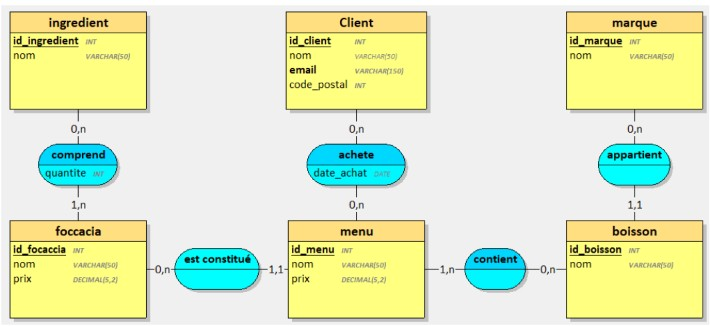

# 🍕 Tifosi — MySQL Database

Design and implementation of a relational database for **Tifosi**, a fictional Italian street-food restaurant.

> Fictional project built as part of the Web & Mobile Web Developer training (Centre Européen de Formation).

---

## 📖 About the project

Tifosi sells focaccias, drinks and menus. The goal was to turn the restaurant's needs into a working MySQL database: design the data model, create the schema, insert test data, then check the result with a set of SQL queries.

The project covers the full database design workflow:

1. **Analysis** of the business needs (focaccias, ingredients, drinks, brands, menus, customers)
2. **Data modelling**: entities, relationships and junction tables for many-to-many relationships
3. **Implementation** of the schema in SQL, with a dedicated MySQL user
4. **Test data** insertion
5. **Validation** through 10 queries, each documented with its expected result, actual result and gap

---

## 🛠 Tech stack

| Tool | Usage |
|---|---|
| MySQL 8 | Relational database |
| SQL | Schema (DDL), data (DML) and queries |
| VS Code + SQLTools | Writing and running the scripts |
| Git / GitHub | Versioning, with feature branches and pull requests |

---

## 🔐 Data model

The database contains **9 tables**:

- **Main tables:** `focaccia`, `ingredient`, `boisson` (drink), `marque` (brand), `menu` (linked to one focaccia), `client`
- **Junction tables** (many-to-many relationships):
  - `focaccia_comprend_ingredient` — which ingredients a focaccia contains, with a `quantite` (quantity)
  - `menu_contient_boisson` — which drinks a menu includes
  - `client_achete_menu` — which menus a customer bought, with a `date_achat` (purchase date)

### Conceptual data model (MCD)

<p align="center">
  
</p>

*Conceptual data model provided in the project brief, implemented in `01_schema.sql`. Each many-to-many association becomes a junction table, and each 1,1 cardinality becomes a foreign key (e.g. `boisson.id_marque`, `menu.id_focaccia`).*

**Test data:** 8 focaccias, 25 ingredients, 12 drinks from 4 brands, and the composition of each focaccia. The `menu` and `client` tables are created and ready, without test data.

---

## 🔎 Validation queries

`03_queries.sql` contains 10 queries. Each one is documented with the **expected result**, the **SQL code**, the **actual result** and the **gap** between the two, as in a test report.

| # | Query | SQL concepts |
|---|---|---|
| 1 | Focaccias sorted alphabetically | `ORDER BY` |
| 2 | Total number of ingredients | `COUNT` |
| 3 | Average price of focaccias | `AVG` |
| 4 | Drinks with their brand, sorted by name | `JOIN` |
| 5 | Ingredients of a Raclaccia | Multiple `JOIN`, `WHERE` |
| 6 | Number of ingredients per focaccia | `GROUP BY` |
| 7 | Focaccia with the most ingredients | `GROUP BY`, `ORDER BY`, `LIMIT` |
| 8 | Focaccias containing garlic | Multiple `JOIN`, `WHERE` |
| 9 | Unused ingredients | Subquery with `NOT IN` |
| 10 | Focaccias without mushrooms | Subquery with `JOIN` and `NOT IN` |

All 10 queries return the expected result.

---

## 🗂 Project structure

```
tifosi-bdd/
├── 01_schema.sql    # Database, dedicated MySQL user and tables
├── 02_data.sql      # Test data
├── 03_queries.sql   # 10 validation queries with expected and actual results
└── README.md
```

---

## 🚀 Getting started locally

### Prerequisites
- MySQL 8.0 or higher
- VS Code with the **SQLTools** and **SQLTools MySQL/MariaDB Driver** extensions (or any MySQL client)

### Steps

1. Clone the repository:
   ```bash
   git clone https://github.com/Marine-Briet/tifosi-bdd.git
   ```
2. Connect to MySQL as `root@localhost`.
3. Run the scripts in order:
   1. `01_schema.sql` — creates the `tifosi` database, a dedicated `tifosi` user and the 9 tables
   2. `02_data.sql` — inserts the test data
   3. `03_queries.sql` — runs the validation queries

> The `tifosi` user's password is written in `01_schema.sql` for this local training exercise only. In a real project, credentials would be kept out of version control.

---

## 🔭 Future improvements

- Add test data for menus, customers and purchases, with queries on sales (e.g. revenue per menu)
- Add `ON DELETE` rules on foreign keys
- Use composite primary keys on junction tables to prevent duplicate pairs

---

## 👤 Author

Marine BRIET
Built as part of the Web & Mobile Web Developer training — Centre Européen de Formation.